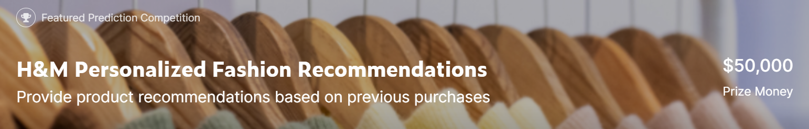
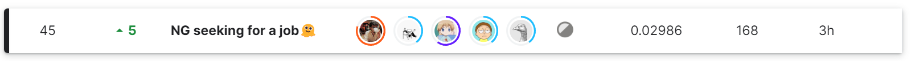

# H&M Personalized Fashion Recommendations

Kaggle [H&M Personalized Fashion Recommendations](https://www.kaggle.com/competitions/h-and-m-personalized-fashion-recommendations/overview) 🥈 Silver Medal Solution 45/3006

This repo contains our final solution. Big shout out to my wonderful teammates! [@zhouyuanzhe](https://github.com/zhouyuanzhe) [@tarickMorty](https://github.com/tarickMorty) [@Thomasyyj](https://github.com/Thomasyyj) [@ChenmienTan](https://github.com/ChenmienTan)

Project Organization
------------

    ├── LICENSE
    ├── README.md
    ├── data
    │   ├── external       <- External data source, e.g. article/customer pre-trained embeddings.
    │   ├── interim        <- Intermediate data that has been transformed, e.g. Candidates generated form recall strategies.
    │   ├── processed      <- Processed data for training, e.g. dataframe that has been merged with generated features.
    │   └── raw            <- The original dataset.
    │
    ├── docs               <- Sphinx docstring documentation.
    │
    ├── models             <- Trained and serialized models
    │
    ├── notebooks          <- Jupyter notebooks. 
    │
    └── src                <- Source code for use in this project.
        ├── __init__.py    <- Makes src a Python module
        │
        ├── data           <- Scripts to preprocess data
        │   ├── datahelper.py
        │   └── metrics.py
        │
        ├── features       <- Scripts of feature engineering
        │   └── base_features.py
        │
        └── retrieval      <- Scripts to generate candidate articles for ranking models
            ├── collector.py
            └── rules.py

--------

<small>Project based on the <a target="_blank" href="https://drivendata.github.io/cookiecutter-data-science/">cookiecutter data science project template</a>. #cookiecutterdatascience</small>

